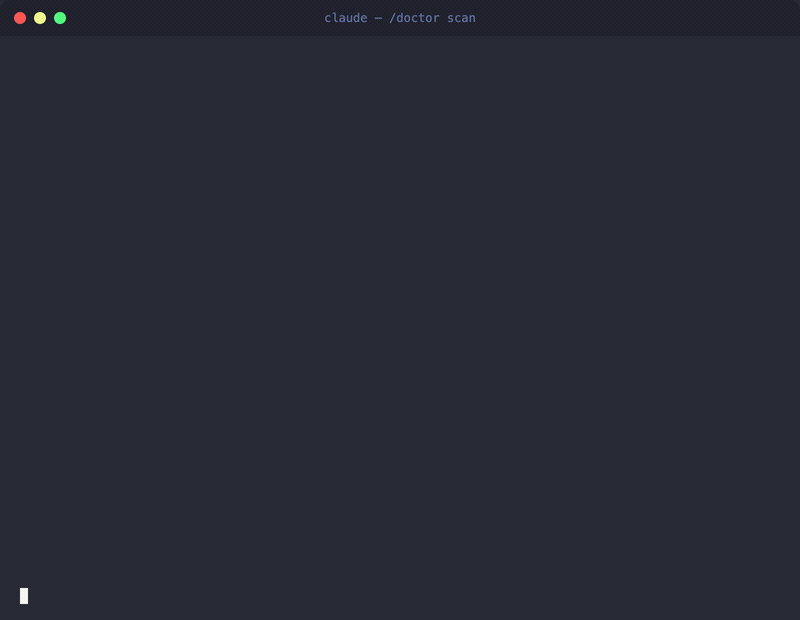
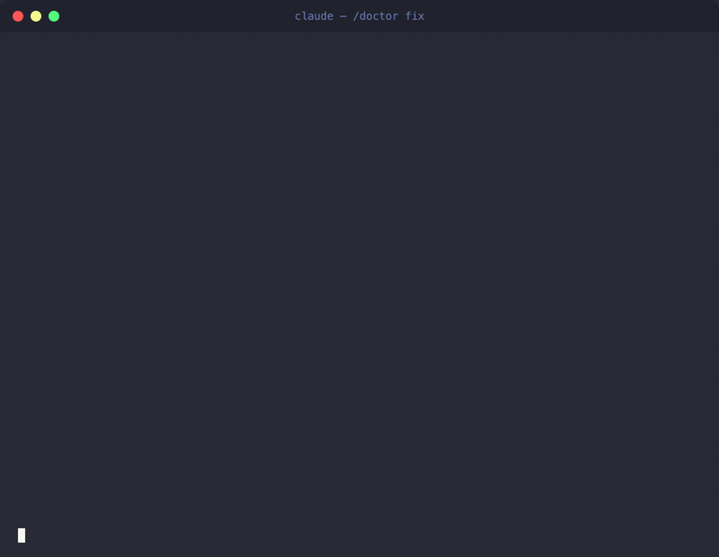

# Doctor — Project Automation Audit Skill for Claude Code

[](https://docs.anthropic.com/en/docs/claude-code/)
[](LICENSE)
[](#6-layers-42-checks)
[](#6-layers-42-checks)
[](#multi-stack-support)
[](#requirements)
[](https://t.me/codeonvibes)

> **42 automated checks across 6 layers. Security first.**
> For [Claude Code](https://docs.anthropic.com/en/docs/claude-code/) CLI.

---

## What It Does

Doctor scans any project and diagnoses automation gaps: missing security checks, broken hooks, absent tests, misconfigured CI. Then prescribes and applies project-specific fixes.

Every finding explains **WHY** it matters, with a source link.

### `/doctor scan` — Diagnose



### `/doctor fix` — Prescribe + Apply



---

## 6 Layers, 42 Checks

| Layer | Name | Checks | What It Covers |
|-------|------|--------|----------------|
| 0 | **Security** | 11 | Secrets in git, SAST, .gitignore, .env permissions, Docker security, client-side keys |
| 1 | **Foundation** | 5 | CLAUDE.md, dependency manifest, build scripts, project structure, dep freshness |
| 2 | **Quality Gates** | 11 | Linter, PostToolUse/PreToolUse hooks, pre-commit, CI, error handling, types, coverage |
| 3 | **Intelligence** | 2 | Agent trio (code-reviewer, debugger, architect), domain rules with paths |
| 4 | **Context** | 5 | MCP servers, plugins (context7, episodic-memory), memory files, SessionStart hook |
| 5 | **DX** | 7 | Skills (/test, /status), hook installer, Dependabot, stop hook, unit & smoke tests |

---

## Install

**One line:**

```bash
curl -sSL https://raw.githubusercontent.com/SomeStay07/claude-doctor-skill/main/install.sh | bash
```

**Manual:**

```bash
mkdir -p .claude/skills/doctor/layers
cd .claude/skills/doctor

# Main files
curl -O https://raw.githubusercontent.com/SomeStay07/claude-doctor-skill/main/SKILL.md
curl -O https://raw.githubusercontent.com/SomeStay07/claude-doctor-skill/main/CHECKLIST.md

# Layer details
cd layers
for f in SECURITY FOUNDATION QUALITY QUALITY-EXTRA INTELLIGENCE CONTEXT DX; do
  curl -O "https://raw.githubusercontent.com/SomeStay07/claude-doctor-skill/main/layers/$f.md"
done
```

---

## Usage

| Command | What It Does |
|---------|-------------|
| `/doctor` | Full audit — all 6 layers, all 42 checks |
| `/doctor scan` | Diagnose only (phases 1-2, no file changes) |
| `/doctor fix` | Prescribe + apply fixes (phases 3-4) |
| `/doctor layer <N>` | Audit specific layer (0-5) |
| `/doctor verify` | Health check after fixes (phase 5) |

---

## How It Works

```
Phase 1: STUDY        Read project: deps, structure, .env, git, automation
                      Output: Project Profile table

Phase 2: DIAGNOSE     Run 42 checks from CHECKLIST.md
                      Score each layer: X/Y (N%)

Phase 3: PRESCRIBE    For each finding:
                      severity + what to fix + WHY + source link

Phase 4: TREAT        Ask user: "Fix all at once or one by one?"
                      Apply project-specific fixes (not templates)

Phase 5: VERIFY       Run tests, linter, check hooks
                      Output: HEALTH REPORT with total score
```

### Auto-Discovery (DCI)

Doctor automatically detects your stack at startup via Dynamic Context Injection:

```
package.json / requirements.txt / Cargo.toml    → stack detection
Makefile / justfile                               → build system
.claude/ / .mcp.json                              → Claude Code setup
Dockerfile / docker-compose.yml                   → containerization
.github/workflows/                                → CI/CD
```

No configuration needed. Works with 20+ stacks out of the box.

### Built-in Guardrails

- **Error Recovery** — handles missing git, no tests, no Docker, context overflow
- **Self-Check** — validates findings before output (no inflated severity, no duplicates)
- **False Positives** — won't flag missing CI in hobby projects, print() in CLI scripts, etc.
- **Definition of Done** — audit isn't complete until all layers scored and user asked about fixes

---

## Multi-Stack Support

Doctor adapts to whatever stack it finds:

| Stack | Linter | Formatter | Test Runner | SAST |
|-------|--------|-----------|-------------|------|
| Python | ruff | ruff format | pytest | bandit |
| Node.js | eslint | prettier | jest/vitest | eslint-plugin-security |
| TypeScript | eslint + tsc | prettier | jest/vitest | eslint-plugin-security |
| Rust | clippy | rustfmt | cargo test | cargo-audit |
| Go | golangci-lint | gofmt | go test | gosec |
| Ruby | rubocop | rubocop | rspec | brakeman |
| Java | checkstyle | google-java-format | JUnit | SpotBugs |
| PHP | phpstan | php-cs-fixer | PHPUnit | psalm |

---

## Comparison

| Feature | Doctor | [memory-skill](https://github.com/SomeStay07/claude-memory-skill) | [code-reviewer](https://github.com/SomeStay07/code-review-agent) |
|---------|--------|-------------|---------------|
| Total checks | **42** | N/A | N/A |
| Layers | **6** | 1 | 1 |
| Auto-discovery (DCI) | **Yes** | Yes | No |
| Error recovery | **Yes** | No | Yes |
| Self-check | **Yes** | No | Yes |
| False positives list | **Yes** | No | Yes |
| Multi-stack | **20+** | No | TypeScript/React |
| Security audit | **11 checks** | No | Partial |
| Bilingual (EN/RU) | **Yes** | No | Yes |
| One-line install | **Yes** | Yes | Yes |

---

## File Structure

```
claude-doctor-skill/
  SKILL.md           — Main skill file (entry point for Claude Code)
  CHECKLIST.md       — Index of all 42 checks across 6 layers
  layers/
    SECURITY.md      — Layer 0: 11 security checks + incident response
    FOUNDATION.md    — Layer 1: 5 foundation checks
    QUALITY.md       — Layer 2: 7 core quality gate checks
    QUALITY-EXTRA.md — Layer 2: 4 advanced quality checks
    INTELLIGENCE.md  — Layer 3: 2 agent intelligence checks
    CONTEXT.md       — Layer 4: 5 context & memory checks
    DX.md            — Layer 5: 7 developer experience checks
  install.sh         — One-line installer
```

---

## Requirements

- [Claude Code](https://docs.anthropic.com/en/docs/claude-code/) CLI installed
- A project directory with source code

No API keys, no dependencies, no build step. Just `.md` files.

---

## Author

Made by [@SomeStay07](https://github.com/SomeStay07) · [Telegram Channel](https://t.me/codeonvibes)

---

## License

MIT
